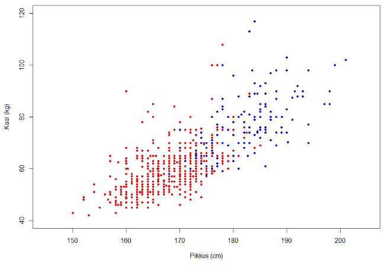
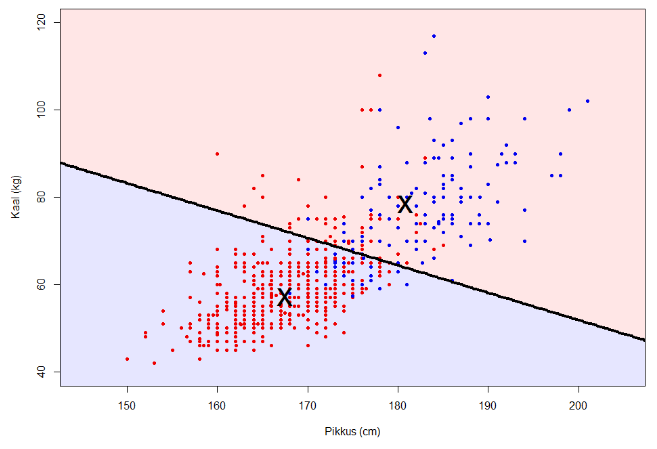
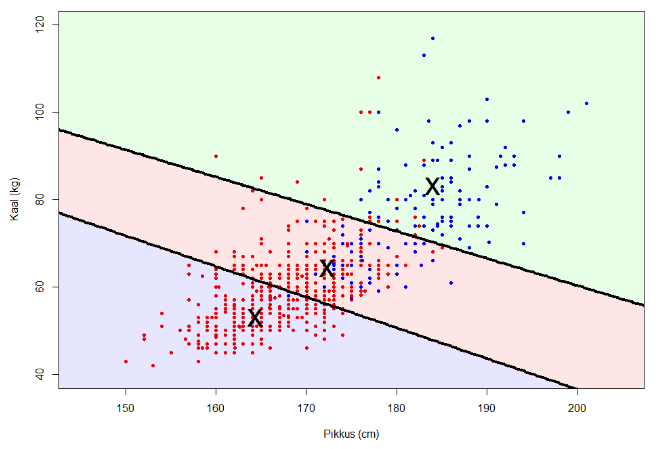

```{r setup, include=FALSE}
knitr::opts_chunk$set(echo = TRUE)
```

## Ettevalmistused

Kui soovid koolitust oma arvutiga kaasa teha, siis esmalt paigalda Rstudios järgmised paketid. Vaikimisi seadistustega laetakse need sulle alla ja paigaldatakse automaatselt. Kuna mitmed paketid kasutavad veel omakorda lisapakette, siis võib juhtuda, et sinu arvutisse paigaldatakse palju rohkem pakette kui allolevas koodis kirjas.

```{r eval = F}
install.pacakges('readxl')
install.packages('dplyr')
install.packages('corrplot')

# Ja laeme paketid töömällu järgmiselt
library(readxl)
library(dplyr)
library(corrplot)
```

```{r echo = F, message = F}
suppressPackageStartupMessages(library(readxl))
suppressPackageStartupMessages(library(dplyr))
suppressWarnings(suppressPackageStartupMessages(library(corrplot)))
```


```{r eval = F, echo = F}
# Töökausta seadistamine - 
#    töökaustaks seatakse automaatselt kaust kus asub käesolev fail
install.packages('rstudioapi')
setwd(dirname(rstudioapi::getActiveDocumentContext()[[2]]))
```


## Sissejuhatus

Klientide segmenteerimiseks (või ükskõik milliste andmete lahterdamiseks) kasutame k-keskmiste meetodit (_k-means_). Käime läbi järgmised etapid:

* Andmetega tutvumine
* Andmete puhastamine
* Andmete rikastamine
* Uute andmete eraldamise, agregeerime
* Teostame segmenteerimise
* Analüüsime tulemusi

Näidis analüüsi tegemiseks kasutame vabalt kättesaadavat andmestikku [UCI Machine Learning Repository](https://archive.ics.uci.edu/ml/datasets/online+retail#) veebilehelt, mis on omakorda saanud andmed [Chen, Sain & Guo (2012)](https://link.springer.com/article/10.1057/dbm.2012.17) artiklist. 

Andmesikus on Suurbritannias registreeritud veebipoe tehinguandmed vahemikus 1. detsember 2010 - 9.  detsember 2011. Veebipoes müüakse enamasti igasugusteks puhkudeks kingitusi ja paljud veebipoe kliendid on jae- või hulgimüüjad. Veebipood tegutseb rahvusvaheliselt aga suur enamus klientuurist on pärit Suurbritanniast.

Andmestiku saate sisse laadida järgmise käsu abil:

```{r}
library(readxl)
jaemyyk <- read_excel("../data/jaemyyk.xlsx", 
     col_types = c("text", "text", "text", 
          "numeric", "date", "numeric", "text", 
          "text"))


```

## Andmeväljad ja andmestikuga tutvumine

Kui andmestikuga kaasa tulnud tunnuste kirjeldused on järgmised:

* `arve_nr` - Arve number. Nominaalne tunnus, 6-kohaline arv, mis on iga tehingu puhul unikaalne. Kui kood algab 'c' tähega, siis indikeerib see tühistatud tehingut.
* `kood` - Toote või kauba kood. Nominaalne tunnus, 5-kohaline unikaalne number iga toote kohta.
* `kirjeldus` - Toote või kauba kirjeldus. Nominaalne tunnus.
* `kogus` - Iga toote või kauba kogus, mis osteti käesoleval tehingul. Numbriline tunnus.
* `ostu_kp` - Tehingu toimumise kuupäev ja kellaaeg.
* `yhiku_hind` - Toote või kauba ühiku hind. Numbriline, valuuta GBP.
* `kliendi_id` - Unikaalne kliendi ID. Nominaalne tunnus, 5-kohaline number.
* `riik` - riigi nimi. Nominaalne tunnus, riik, kus klient resideerub.

Veendumaks, et tõepoolest on kõik tunnused olemas ning uurimaks andmete sisu, siis käivita järgmised käsud. Mida teevad käsud `head()`, `str()` ja `summary()`?

```{r}
head(jaemyyk)
str(jaemyyk)
summary(jaemyyk)
```

Kas neid väljavõtteid vaadates tekkis mõni küsimus, mida sooviks lähemalt uurida? Näiteks milline on numbriliste väljade jaotus? Mis riikidest on veebipoe kliendid pärit?

Kui eelnevast ei piisanud võib andmeid edasi uurimiseks genereerida järgmise väga põhjaliku [raporti](report.html):

```{r eval = F}
library(DataExplorer)
DataExplorer::create_report(jaemyyk)
```


## Andmete puhastamine

Eelnevast andmetega tutvumisest selgus, et paljud andmepunktid on ebaloogilised või ebavajalikud. Kui ise töötate juba pikemat aega andmeanalüütikuna ühes ja samas ettevõttes, siis on tihti anomaaliate põhjused teada. Kui aga andmestik on täiesti uus, siis tuleks ebaloogiliste andmete põhjused välja uurida. 

Kui tegemist on vigase sisestusega (nt hind sisestati käsitsi ja koma jäi kahe silma vahele), siis tuleks sellised andmed välja jätta või ära parandada kui võimalik.

Kui aga on tegemist erindiga, siis on otsustuskoht, kas erindid sisse jätta või minema visata. Hetkel viskame erindid ja ebaloogilised väärtused välja, sest ei ole võimalik nende põhjust välja uurida ning need võivad segmenteerimist segama hakata.

Puhastame andmestiku:

```{r}
jaemyyk <- jaemyyk %>% 
  filter(!is.na(kliendi_id), # tehingud millel puudub kliendi ID
         kogus > 0,          # ainult kogus > 0
         yhiku_hind > 0,     # Ühiku hind olgu alati positiivne
         substr(arve_nr,1,1) != 'C', # Eemaldame tühistatud tehingud
         kogus < 3000,       # Ebamõistlikult suured kogused
         yhiku_hind < 3000   # Väga kallid tooted jätame kõrvale
         )

summary(jaemyyk)
```

## Rikastame andmeid

Esialgne andmestik ei pruugi kogu informatsiooni sisaldada, seega tuleks alati vaadata, kas saab uusi tunnuseid lisada, mis teevad analüüsi sisukamaks. Hetkel ei anna toote ühiku hind ja ostetud toote kogus piisavat infot kliendi käitumisest. Leiame ostu summa ja kuupäevad on alati hea infoallikas tegemaks keerukamaid analüüse - kuu vs kuu muutus, sessoonsus, tunnuste ajaline sõltuvus jpm.

```{r}
# Rikastame andmeid
jaemyyk <- jaemyyk %>% 
  mutate(myyk = yhiku_hind * kogus,
         ostukuu = months(ostu_kp))
```

## Agregeerime klientide andmed

Jällegi ei pruugi toorandmed olla meie küsimustele vastamiseks piisavad. Hetkel huvitab meid klienditaseme info, mitte tehingu taseme info. Peame agregeerima, selleks grupeerime andmed esmalt kliendi kaupa:

```{r message=F}
kliendid <- jaemyyk %>% 
  group_by(kliendi_id) %>% 
  summarise(kaive = sum(myyk),
            tehinguid = length(unique(arve_nr)), # unikaalsete tehingute arv
            kesk_ost = kaive / tehinguid)

summary(kliendid)
```


# Segmenteerimine k-keskmiste meetodi abil

Segmenteerimiseks kasutame k-keskmiste meetodit (_k-means clustering_) mis püüab leida andmepunktide grupeeringuid - ja nagu nimi ütleb, siis keskpunktide kaudu.

Näiteks olgu andmestikus pikkus, kaal ja sugu. Tekitades hajuvusdiagrammi ning värvides punktid soo järgi saame:

<!---->

Nagu näha, siis eristuvad mehed ja naised üsna hästi kaalu ja pikkus järgi. Aga oletame, et me ei tea sugu ja proovime statistiliste meetodite abil hinnata, kas õnnestub antud andmestik jagada kaheks. 

K-keskmiste klasterdamise puhul on eesmärk jagada objekti _k_ klastrisse nii, et iga objekt kuuluks klastrisse mille keskpunkt on talle kõige lähedam. Antud juhul _k_ = 2 ja nagu näha, siis õnnestus objektide gruppeerimine üsna sarnaselt sellele, mida indikeerib sugu.

<!---->

Suuruse _k_ saame ise määrata, näitek _k_ = 3 puhul oleks tuelmus järgmine:

<!---->

Küll aga on võimalik määrata optimaalne gruppide arv _k_. Esmalt aga mõned ettevalmistused.

## k-keskmiste klasterdamise ettevalmistused

Tunnused `kaive`, `tehinguid` ja `kesk_ost` on üsna eriskummaliste jaotustega. Neil kõigil on väga palju vaatlusi väikeste väärtustega ja "raskete sabadega" ehk mõned esktreemsed väärtusd. Veendu selles eelnevalt räägitud raporti abil või jooksuta nt `hist(kliendid$kaive`.

Kuna keskmised on tugevalt mõjutatud ekstreemsete väärtuste poolt, siis tuleb nende mõju vähendada. Selleks on erinevaid andmete transformeerimisviise - nt logaritmimine. 

Võrdle näiteks järgmisi jooniseid:

<!--
```{r echo = F, figures-side, fig.show="hold", out.width="50%"}

hist(kliendid$kaive, xlab = 'Käive',
     main = 'Tunnuse "käive" histogramm',
     ylab = 'sagedus')

hist(log(kliendid$kaive), xlab = 'Logaritmitud käive',
     main = 'Logaritmitud "käive" histogramm',
     ylab = 'sagedus')


```
-->
Logaritm säilitab väärtuste järekorra ja hiljem kui on vaja tõlgendada, siis saame kasutada pöördfunktsiooni ehk eksponenti `exp()`.

Ühtlasi töötab _k_-keskmiste klasterdamine standardiseeritud (keskmine = 0 ja sd = 1) andmetega. Seda saame teha käsuga `scale()`. Kohe kindlasti tuleb standardiseerida andmestikku kui tunnused on erinevate skaaladega (nt "pikkus sentimeetrites" skaala VS "laste arv perekonnas" skaala).

Kogu eelneva saame tehtud järgmiste käskudega:

```{r}
# Skaleerime andmed
kliendid <- kliendid %>% 
  mutate(log_kaive = log(kaive),
         log_tehinguid = log(tehinguid),
         log_kesk_ost = log(kesk_ost))

skaleeritud <- kliendid %>% 
  select(log_kaive, log_tehinguid, log_kesk_ost) %>% 
  scale() 
```

## Klastrite arvu _k_ määramine

Kuna antud meetod tahab, et me annaksime klastrite arvu ette, siis kuidas teha seda andmetest lähtuvalt?

Selleks saame kasutada "küünarnuki" meetodit (_elbow method_). Nimi on kentsakas aga tuleneb alloleva joonise kujust. Siin määratakse mitme klastriga toimub veel nö arvestatav "muutus" ehk millise klastrite arvu juures on klastrite keskpunktid üksteisest veel piisavalt kauged, et need eristaksid gruppe. Arvestatava "muutuse" määramine on tunnetuslik aga alloleval joonisel ütleks, et vasakult poolt pärast 4-ndat täppi suuremat langust enam ei toimu.

```{r}
# Eelnevad suurused, mis on vaja defineerida
k = 1:20
pr = 1

# Proovime läbi kõik klasterdamised klastriarvuga 1st-20ni.
for (i in 2:20){
  km = kmeans(skaleeritud,i)
  pr[i] = km$tot.withinss/km$totss
}

# Küünarnuki joonis
plot(k,pr,type="b")
```

## Klientide segmenteerimine

Olles teinud ära kogu eeltöö saame lõpuks leida klientide grupid. Funktsioon ise aga klastreid ei nimeta ega analüüsi, seega milliseid iseloomustavaid nimesid annaksid klastritele alloleva joonise järgi?

```{r}
# Klasterdamer ja leiame klastrite keskmised (ehk keskpunkti)
klastrid = kmeans(skaleeritud,4)
klastrid$centers

# Joonis, mis hõlbustab analüüsimist
corrplot(klastrid$centers, is.corr=F, main = 'Klastrite keskmised')
```
Võime veenduda oma tõlgendustes järgmiste abistavate jooniste abil:


```{r}
plot(kliendid$log_kaive, kliendid$log_tehinguid, col = klastrid$cluster, pch = 20,
     xlab = 'Käive',
     ylab = 'Tehingute arv',
     main = 'Käibe ja tehingute arvu hajuvusdiagramm')

plot(kliendid$log_tehinguid, kliendid$log_kesk_ost, col = klastrid$cluster, pch = 20,
     xlab = 'Tehingute arv',
     ylab = 'Keskmine ostusumma',
     main = 'Tehingute arvu ja keskmise ostusumma hajuvusdiagramm')

plot(kliendid$log_kaive, kliendid$log_kesk_ost, col = klastrid$cluster, pch = 20,
     xlab = 'Käive',
     ylab = 'Keskmine ostusumma',
     main = 'Käibe ja keskmise ostusumma hajuvusdiagramm')
```

Kui nüüd soovime teada millised kliendid kuuluvad teatud klastrisse (et siis vastavalt adresseerida või nt turundust suunata nendele), siis saame klientide ID-d eraldada järgmiste käskude abil:


```{r eval = F}
kliendid$kliendi_id[klastrid$cluster == 1] # 1. klastrisse kuuluvad kliendid
kliendid$kliendi_id[klastrid$cluster == 2] # 2. klastrisse kuuluvad kliendid
# jne
```


