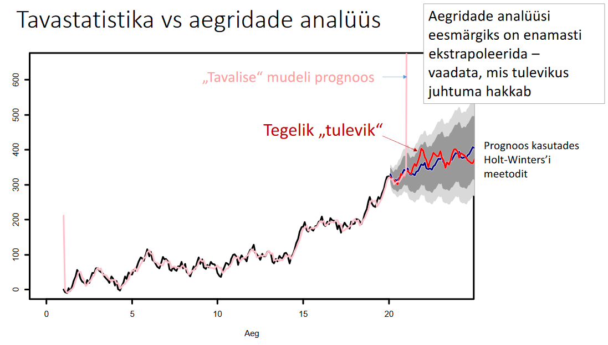
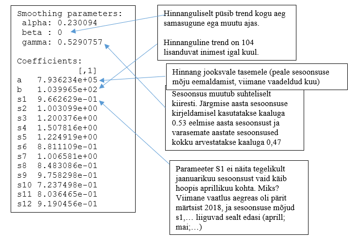

```{r echo = F}
suppressPackageStartupMessages(library(forecast))
```


## Sissejuhatus aegridade analüüsi

Tavaline statistika aegridade puhul ei aita, sest aegridade puhul eiratakse ühte põhilist eeldust statistikas - vaatluste sõtlumatus. Selle tõttu võib tavastatistika mudel väga imelikke tulemusi anda:




## Holt-Winters'i meetod

Proovime leida Holt-Winters’i meetodil Tallinki reisijate arvu prognoosi.

Loeme sisse näiteandmed:

```{r}
load(url("https://github.com/Rkursus/andmeanalyytik/raw/master/data/reisijaid.RData"))
head(Tallink)
attach(Tallink)
```

ja teisendame andmed aegreaks:


```{r}
y=ts(reisijaid, start=c(2012,5), frequency=12)
y
plot(y)
```


Järgnevalt hindame Holt-Winters’i mudeli. Hindame 

* sesoonsust - kas eelmise aasta muster kordub aastast aastasse? Nt suvel on rohkem reisijaid, talvel vähem aga detsembris on jälle natuke suurem reisijate liikumine jõulude tõttu.
* Trendi - kas ajas reisijate arv suureneb või väheneb stabiilselt?
* Autoregressiivsust ehk kuidas mõjutab eelmine kuu käesolevat.
* Iga üksiku kuu sesoonset mõju võrreldes keskmisega.

```{r}
m1=HoltWinters(y, seasonal="mult")
```





Kontrollime mudeli prognoosivõimet – kui hästi ta on varem suutnud tulevikku näha?
	
```{r}
plot(m1)
```

Prognoosime nüüd tulevikku aga esmalt veendu, et sul oleks `forecast` pakett paigaldatud ja töömällu loetud:
```{r eval = F}
install.packages('forecast')
library(forecast)
```

Prognoosime leitud mudeli abil kaks aastat (24 kuud) tulevikku

```{r}
prog = forecast(m1, h=24)
prog

plot(prog, xlim=c(2012, 2020), main="Tallinki reisijate arvu prognoos")
```

  
Soovi korral võid mängida kunstnikku ja leida kõige meelepärasem graafik prognooside esitamiseks:

```{r}
prog = forecast(m1, h=24, level=0.95)
plot(prog, xlim=c(2012, 2020), main="Tallinki reisijate arvu prognoos")

prog = forecast(m1, h=24, level=c(0.5, 0.9, 0.95, 0.99))
plot(prog, xlim=c(2012, 2020), main="Tallinki reisijate arvu prognoos", 
  	shadecols=c("gray95", "gray85", "gray80", "gray75") )
```


Ning võid lisada graafikule ka hiljem lisandunud reisijate arvud:

```{r}
plot(prog, xlim=c(2012, 2020), main="Tallinki reisijate arvu prognoos", 
  	shadecols=c("gray95", "gray85", "gray80", "gray75") )
tegelik=c(789272, 852609, 989445, 1223901, 993078, 730631, 785583, 
			654240, 811261, 549278, 620006, 686488, 779113)
teg=ts(tegelik, start=c(2018, 4), frequency=12)
points(teg, col="red", pch=20, cex=2)
```


Veebruar-märts 2020 tabas Euroopat esimene COVID-19 laine ja paratamatult ei pea aegridade analüüs maailmat raputavate sündmuste puhul enam paika.

```{r}
prog = forecast(m1, h=36, level=0.95)
plot(prog, xlim=c(2012, 2021), ylim = c(0,1.3)*10^6,
     main="Tallinki reisijate arvu prognoos", 
  	shadecols=c("gray95", "gray85", "gray80", "gray75") )
tegelik=c(789272, 852609, 989445, 1223901, 993078, 730631, 785583, 
			654240, 811261, 549278, 620006, 686488, 779113, 75511,280520, 617206,
			453880, 243215, 162311, 158777, 141771, 121116, 74129, 71979, 84347,
			124470, 218950, 444112, 389715, 310265)
teg=ts(tegelik, start=c(2018, 4), frequency=12)
points(teg, col="red", pch=20, cex=2)
```

Võid vaadata ka, kuidas erinevad aegrea komponendid (keskmine ilma sessoonsuse mõjuta; trend antud ajahetkel; sesoonsus antud ajahetkel) on ajas käitunud:

```{r}
plot(fitted(m1))
```


# ARIMA - mudelid

On veel mudeleid, mille abil on võimalik aegrea struktuuri esitada, nt ARIMA mudelid. ARIMA ehk _AutoRegressive Integrated Moving Average_ proovib samamoodi aegrea komponentideks lahti lõhkuda autoregressiivse strutuuri abil.

Põhiliseks kasutusvaldkonnaks on lühiajaline prognoosimine:

* makroökonoomika aegread
* finantsaegread
* ettevõtluses nõudlus


R-is on kindel abimees funktsioon `auto.arima()`

```{r}
y = ts(reisijaid, start=c(2012,5), frequency=12)
m2 = auto.arima(y)
prog = forecast(m2, h=10)
plot(prog, xlim=c(2012, 2020), main="Tallinki reisijate arvu prognoos")
```

# STL mudelid ehk sesoonsus-trendi dekompositsioon

STL ehk _Seasonal-Trend decomposition using LOESS_ on veel üks meetod, mis võimaldab aegridu analüüsida ja prognoosi leida. Võrdluseks vaatleme seda, kuidas STL meetod üritab aegrida komponentideks jagada:

```{r}
plot(stl(y, "per"))
```


