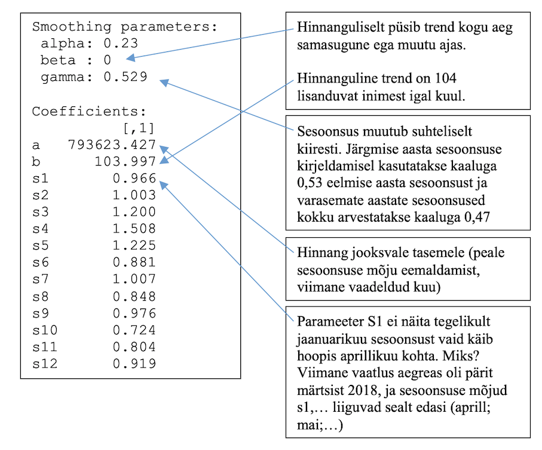

```{r echo = F}
suppressPackageStartupMessages(library(forecast))
options(scipen=999)
options(digits=3)
```


## Sissejuhatus aegridade analüüsi

Tavastatistika aegridade puhul ei aita, sest aegridade puhul eiratakse ühte põhilist eeldust statistikas - vaatluste sõtlumatus. Selle tõttu võib tavastatistika mudel väga imelikke tulemusi anda:


## Andmete ettevalmistus

Proovime leida prognoosi Tallinki reisijate arvu jaoks. Loeme sisse näiteandmed:

```{r}
# Allikas: https://www.tallink.com/reports#tabs-content-6
load(url("https://github.com/Rkursus/andmeanalyytik/raw/master/data/reisijaid.RData"))
head(Tallink)
attach(Tallink)
```

ja teisendame andmed aegreaks:

```{r}
y = ts(reisijaid, start=c(2012,5), frequency=12)
y
plot(y)
```

## Aegrea analüüsimine

Järgnevalt hindame Holt-Winters’i mudeli, selle meetodi abil saame hinnata: 

* Autoregressiivsust (_alpha_) - kuidas mõjutab eelmine kuu käesolevat.
* Trendi (_beta_) - kas ajas reisijate arv suureneb või väheneb stabiilselt?
* sesoonsust (_gamma_) - kas eelmise aasta muster kordub aastast aastasse? Nt suvel on rohkem reisijaid, talvel vähem aga detsembris on jälle natuke suurem reisijate liikumine jõulude tõttu.
* Iga üksiku kuu sesoonset mõju võrreldes keskmisega (_s1-s12_).

```{r echo=F}
m1 = HoltWinters(y, seasonal="mult")
```

```{r eval=F}
m1 = HoltWinters(y, seasonal="mult")
m1
```



Järgnev joonis annab aimu kuidas erinevad aegrea komponendid on ajas käitunud, seal näed:

* *data* - algsed andmed ilma komponentideks lahku löömata.
* *seasonal* - sesoonsuse komponent, kuivõrd stabiilne on resisijate arvu muster aastast-aastasse.
* *trend* - kuidas on trend ajapikku muutunud.
* *remainder* - jääk, üldiselt kui "tulbad" jagunevad ühtlaselt, siis on komponentideks lahku löömine hästi õnnestunud.

```{r}
plot(stl(y, "per"), main = "Aegrea komponendid")
```

Jooniste paremas servas olevad hallid kastid näitavad vastava komponendi skaalat, õigemin kui palju on pilti "suurendatud". Kõige ülemine paneb paika skaala võrdlusbaasi. Ülal oleval joonisel on seega sesoonne komponent samas skaalas kui algandmed. Trendi komponendi pilti on aga tugevalt suurendatud, oleks skaala sama mis algandmetel, siis näeksime ilmselt vaid sirget joont.

<!--
Auto-correlation ja Partial-autocorrelation
```{r}
pacf(y)
```
-->


## Prognoosimine

Kontrollime mudeli prognoosivõimet – kui hästi ta on *varem* suutnud tulevikku näha?
	
```{r}
plot(m1)
```

Prognoosime nüüd tulevikku aga esmalt veendu, et sul oleks `forecast` pakett paigaldatud ja töömällu loetud:
```{r eval = F}
install.packages('forecast')
library(forecast)
```

Prognoosime leitud mudeli abil kaks aastat (24 kuud) tulevikku

```{r}
prog = forecast(m1, h=24)
prog

plot(prog, xlim=c(2012, 2020), main="Tallinki reisijate arvu prognoos")
```


### Ülesanne nuputamiseks

_Millised järeldused saad teha vastavalt ülevel saadud joonisele? Kuivõrd täpne on prognoos? Millele see võib vihjata? Kuidas saab antud prognoosi kasutada ettevõtte igapäevases tegevuses?_


## Prognoosi võrdlus tegelikkusega

Lisame graafikule prognoositud perioodi tegelikud reisijate arvud:

```{r}
plot(prog, xlim=c(2012, 2020), main="Tallinki reisijate arvu prognoos")
tegelik=c(789272, 852609, 989445, 1223901, 993078, 730631, 785583, 
			654240, 811261, 549278, 620006, 686488, 779113,853309,1019421,
			1238871,1017565,718354,800828,698293,781684,617374,669849)
teg=ts(tegelik, start=c(2018, 4), frequency=12)
points(teg, col="red", cex=1.2, pch=20)
```


Veebruar-märts 2020 tabas Euroopat esimene COVID-19 laine ja paratamatult ei pea aegridade analüüs maailmat raputavate sündmuste puhul enam paika.

```{r}
prog = forecast(m1, h=60, level=0.95)
plot(prog, xlim=c(2012, 2023), ylim = c(0,1.3)*10^6,
     main="Tallinki reisijate arvu prognoos", 
  	shadecols=c("gray95", "gray85", "gray80", "gray75") )
tegelik=c(789272, 852609, 989445, 1223901, 993078, 730631, 785583, 
			654240, 811261, 549278, 620006, 686488, 779113, 853309, 1019421,
			1238871, 1017565, 718354, 800828, 698293, 781684, 617374, 669849, 
			279507, 32181, 75511, 280520, 617206, 453880, 243215, 162311, 158777, 
			141771, 121116, 74129, 71979, 84347, 124470, 218950, 444112,389715, 
	    310265, 412046, 351857, 358989, 181687, 235214, 303360, 465945, 
			485741, 600488, 897828, 603284, 392491, 454207, 378540, 463300, 338194)
teg=ts(tegelik, start=c(2018, 4), frequency=12)
lines(teg, col = "red", cex = 3)

```


### Ülesanne nuputamiseks

_Hinda Tallinki reisijate prognoosimudel uuesti kui `reisijaid` andmetele on juurde pandud hiljem lisatud 2018-2022. aasta andmed (`tegelik`). Prognoosi järgmise 12 kuu reisijate arvud. Milliseid otsuseid teeksid kui näeksid sellist prognoosi? Kas ostaksid Tallinki aktsiaid?_

```{r eval=F}
# "Keevita" algsed andmed ja hiljem lisatud tegelikud andmed. Muuda aegreaks:
y2 = ts(append(reisijaid, tegelik), start=c(2012,5), frequency=12)

# Joonista uus aegrida, lahuta komponentideks ja hinda komponente (trend, sesoonsus, juhuslik komponent)
... sinu kood ...

# Hinda Holt-Winters mudel
... sinu kood ...

# Prognoosi järgmised 12 kuud
... sinu kood ...


```

```{r echo=FALSE, eval=FALSE}
# "Keevitame" algsed andmed ja hiljem lisatud tegelikud andmed
y2 = ts(append(reisijaid, tegelik), start=c(2012,5), frequency=12)
plot(y2)
plot(stl(y2, "per"), main = "Aegrea komponendid")

m2 = HoltWinters(y2, seasonal="mult")
m2
plot(m2)

prog = forecast(m2, h=12)
plot(prog, xlim=c(2012, 2024), main="Tallinki reisijate arvu prognoos", 
  	shadecols=c("gray95", "gray85", "gray80", "gray75") )
```


# ARIMA mudelid

On veel mudeleid, mille abil on võimalik aegrea struktuuri esitada ja ilmselt kuuled neist kui aegridadega kokku puutud, näiteks ARIMA mudelid. ARIMA ehk _AutoRegressive Integrated Moving Average_ proovib samamoodi aegrea komponentideks lahti lõhkuda autoregressiivse strutuuri abil.

R-is on kindel abimees funktsioon `auto.arima()`

```{r}
y = ts(reisijaid, start=c(2012,5), frequency=12)
m2 = auto.arima(y)
prog2 = forecast(m2, h=10)
plot(prog2, xlim=c(2012, 2020), main="Tallinki reisijate arvu prognoos")
```

Võrdle tulemusi Holt-Winters mudeliga.


